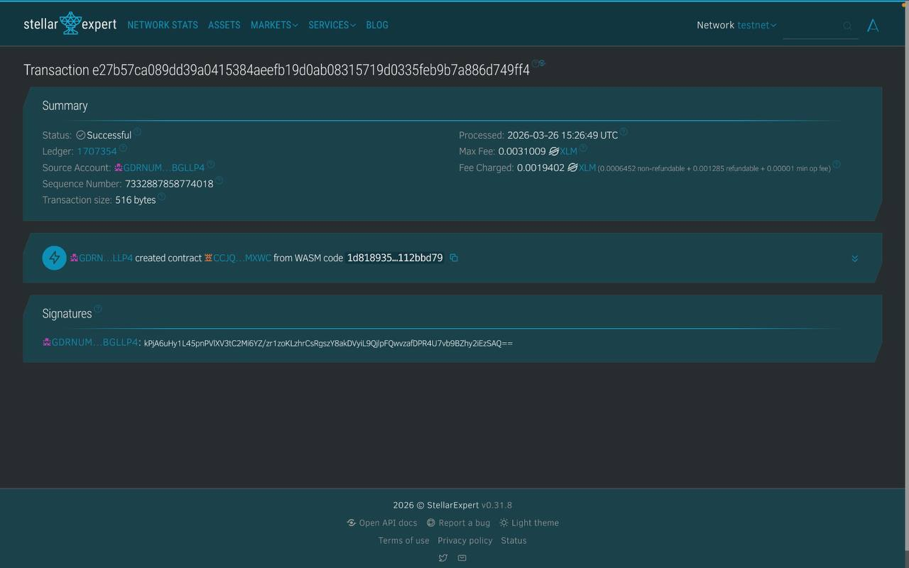

# Stellar Student DApp

Stellar Student DApp – Blockchain Based Student Data Management System

---

## Project Description

Stellar Student DApp is a decentralized smart contract application built using Soroban SDK on the Stellar blockchain.

This project allows users to store and manage student data directly on-chain using a smart contract written in Rust.

The contract supports basic CRUD operations:

* Create student
* Read students
* Update student
* Delete student

All data is stored in contract storage, making it secure, decentralized, and permanent.

---

## Project Vision

This project demonstrates how blockchain technology can be used for academic data management.

Goals:

* Store student data on blockchain
* Remove centralized database dependency
* Ensure data integrity
* Provide transparent data access
* Demonstrate Soroban smart contract usage

---

## Features

* Create student data
* Read all students
* Update student data
* Delete student data
* Stored on Stellar blockchain
* Built with Rust
* Uses Soroban SDK
* Uses contract storage

---

## Data Structure

Each student contains:

* id
* name
* major

Example:

```
Student {
  id: 1,
  name: "John",
  major: "Computer Science"
}
```

---

## Contract Details

Contract Address

```
1d81893574b6587d718303e6efb969c44154a1bb978fde82f93c90ed112bbd79
```

Deploy command

```
stellar contract deploy
```

---

## Screenshot



---

## Future Scope

* Add age field
* Add GPA field
* Add search feature
* Add frontend UI
* Add wallet login
* Add multi user support

---

## Technical Requirements

* Rust
* Soroban SDK
* Stellar CLI
* Stellar Testnet
* Smart Contract Storage

---

## How to Run

Build

```
cargo build
```

Deploy

```
stellar contract deploy
```

Invoke

```
create_student
get_students
update_student
delete_student
```

---

Stellar Student DApp — Student Data on Blockchain
